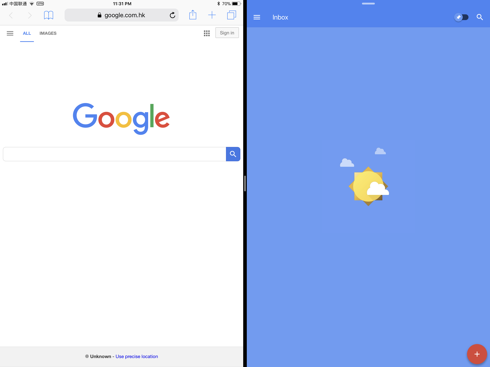
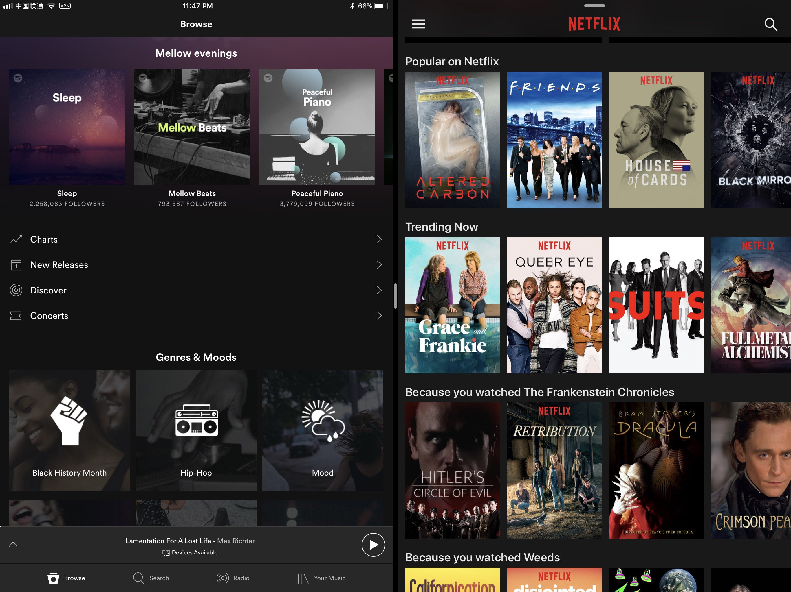
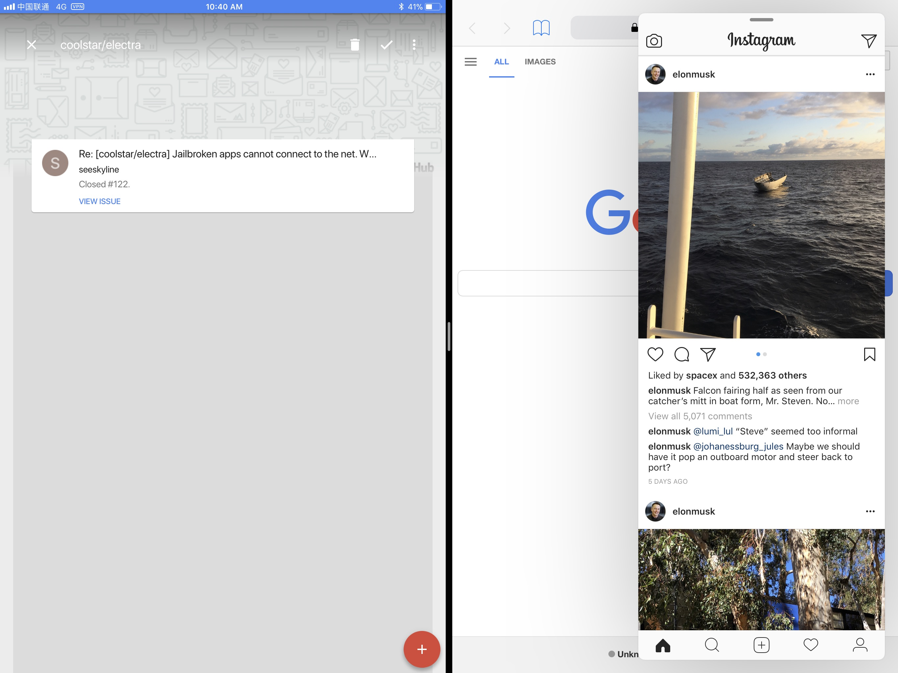
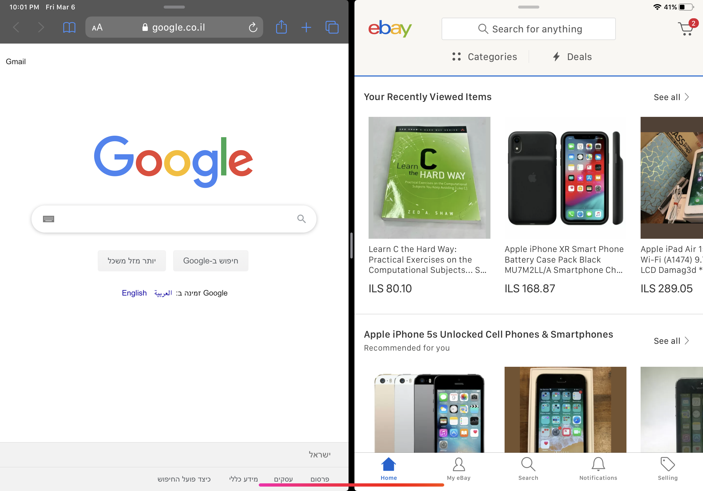
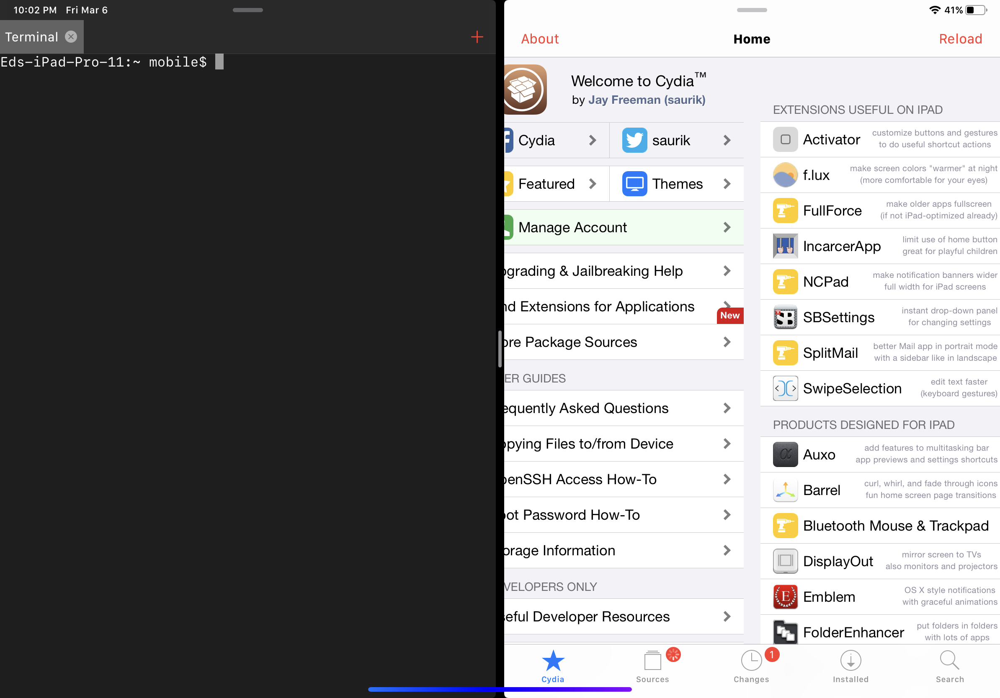

# requirefull

Run all Apps in Split Mode and Slide Over.

Like Inbox

Spotify and Netflix

And even iPhone Apps like Instgram

To top is all of, all app now runs in super retina mode for iPad Pro 12.9 inch.

EXPECT UI GLITCHES, but if some app doesn't work, just launch it again in full screen mode.

The fork includes arm64e (A12+) support, just needed to modify the makefile. A precompiled deb file is in the releases, named com.a12x.requirefull_0.0.2-1+debug_iphoneos-arm.deb.
Tested on iPad Pro 11" on iOS 14.3 with unc0ver 6.0.2.
*I provide **no** support at all, don't attemp to contact me if something doesn't work.*
Thanks for @Jakeashacks for help with compiling and Theos Installer 2

Safari and eBay 

NewTerm and Cydia 

Settings, Twitter and Instagram 

